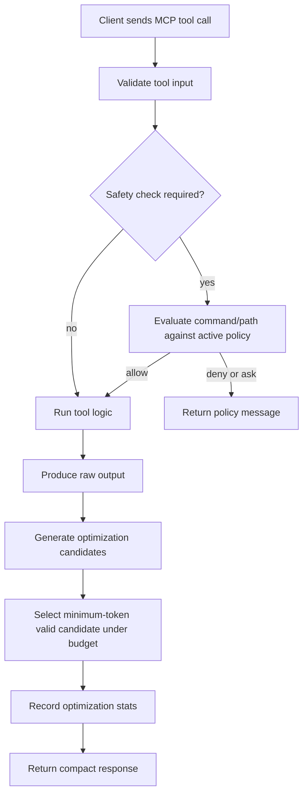
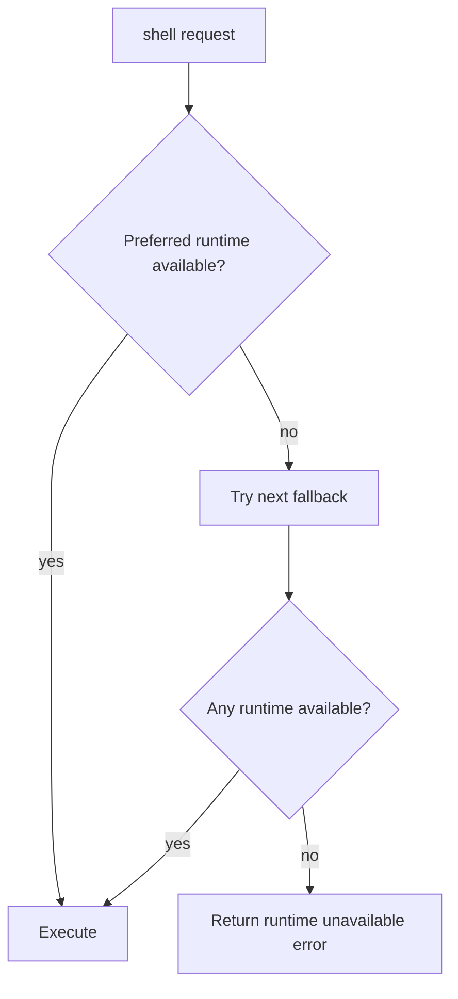

# CONTEXT MODE UNIVERSAL: HOW IT WORKS

## End-to-End Request Flow

## Shell Runtime Resolution (Cross-Platform)

Default shell behavior is `shell_runtime: "auto"`.

Auto fallback order:

1. Windows: `powershell -> cmd -> git-bash -> bash -> sh`
2. macOS: `zsh -> bash -> sh -> powershell`
3. Linux: `bash -> sh -> zsh -> powershell`

Language-specific shell requests (`powershell`, `cmd`, `bash`, `sh`) force that runtime first, then fallback to auto-order candidates.

## Safety and Policy Modes

Policy evaluation happens before execution:

- `strict` (default): blocks destructive and download-execute command patterns.
- `balanced`: blocks high-risk commands and marks destructive commands as `ask`.
- `permissive`: allows commands broadly, but still blocks sensitive file paths.

Policy sets are OS-aware:

- Windows patterns cover PowerShell/cmd destructive operations.
- macOS/Linux patterns cover `rm -rf`, disk tooling, reboot/shutdown variants, and curl/wget pipe-to-shell patterns.

## Compression and Stats

- Every tool response goes through deterministic optimization strategies.
- The optimizer picks the smallest valid candidate under budget.
- Session stats track processed responses, changed outputs, budget-forced responses, and token/byte savings.

## Coding-Focused Token Saving

- `proxy(read_file)` supports focused retrieval by line range, query-context windows, and cursor paging.
- Large file content is cached in-memory with a stable `context_id` so follow-up calls can reuse content without resending it.
- `read_symbols` and `read_references` provide structure-first navigation (symbol map + targeted snippets).
- `diagnostics_focus` condenses build/lint/test output into unique issues.
- `git_focus` converts broad diffs into file-level deltas with changed-symbol hints.

## Knowledge Base

- `index` and `fetch_and_index` store chunked content in SQLite (FTS5 + BM25).
- `search` returns ranked passages for query-driven retrieval.

## Diagnostics

`doctor` reports:

- platform and Node runtime
- configured default shell and resolved shell runtime
- policy mode and fetch-network policy
- execution limits and database path
- safety self-check verdicts
